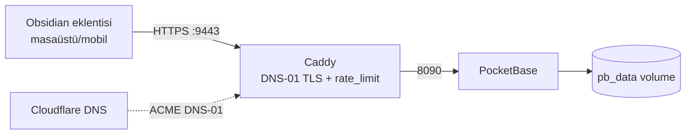
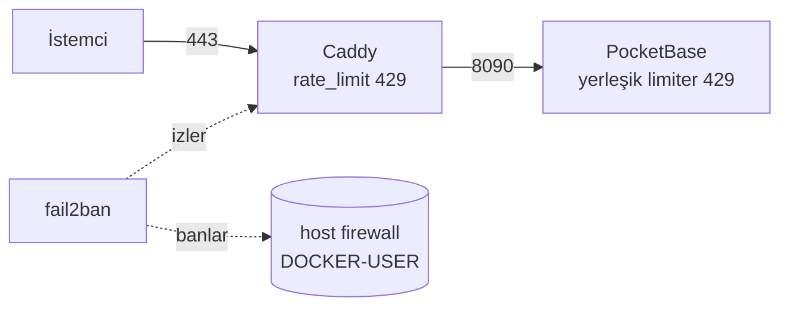

# VPS Dağıtımı (docker-compose)

Bu klasör, PocketBase sync backend'ini bir VPS üzerinde Docker ile ayağa kaldırır.
Eklenti istemcide kalır; VPS'te yalnızca **PocketBase** (+ HTTPS için **Caddy**) çalışır.

## Gereksinimler

- Docker + Docker Compose kurulu bir VPS (Ubuntu/Debian önerilir)
- Bir alan adı: `obsidian.hermes.bilalarikan.com` gibi, VPS IP'sine yönlendirilmiş
  (mevcut `*.hermes` wildcard kaydı bunu zaten karşılar).
- **Caddy için bir HTTPS portu açık** (varsayılan **9443**). 443 başka bir proxy
  tarafından kullanılıyorsa bile çakışma olmaz.
- **Cloudflare API token** (Zone:DNS:Edit) — sertifika **DNS-01** ile alınır, bu
  yüzden 80/443'e ihtiyaç yoktur. Token oluştur:
  <https://dash.cloudflare.com/profile/api-tokens> (şablon: *Edit zone DNS*).

> **Neden DNS-01?** Let's Encrypt normalde 80 (HTTP-01) veya 443 (TLS-ALPN-01)
> ister. Caddy'yi 9443 gibi özel bir porta aldığımız için, sertifikayı port
> gerektirmeyen DNS-01 yöntemiyle (Cloudflare API) alırız. Böylece VPS'teki
> mevcut Caddy (443) ile çakışmaz.

## Mimari



## Kurulum (HTTPS — önerilen)

```bash
# 1. Projeyi VPS'e kopyala (git clone veya scp). deploy/ klasörüne gir:
cd obsidian-pocketbase-sync/deploy

# 2. Ortam dosyasını hazırla
cp .env.example .env
nano .env     # PB_DOMAIN, HTTPS_PORT (9443), CF_API_TOKEN değerlerini gir

# 3. Başlat (Caddy'yi rate-limit+DNS eklentileriyle derler, migration'lar dahil)
docker compose up -d --build

# 4. Superuser (admin) hesabı oluştur
docker compose exec pocketbase /pb/pocketbase superuser upsert "you@example.com" "<güçlü-şifre>"
```

> **UFW (myhermes-vps):** Yeni portlar varsayılan olarak DENY. Mobilin internetten
> erişebilmesi için portu public aç:
> ```bash
> sudo ufw allow 9443/tcp comment 'obsidian-sync public'
> ```

Caddy sertifikayı Cloudflare DNS-01 ile alır (~10-30 sn). Kontrol:

```bash
curl https://obsidian.hermes.bilalarikan.com:9443/api/health   # {"message":"API is healthy."...}
```

Admin UI: `https://obsidian.hermes.bilalarikan.com:9443/_/`

### Eklenti kullanıcısını oluştur

Admin UI → `users` koleksiyonu → yeni kayıt (email + şifre). Veya API ile:

```bash
BASE=https://obsidian.hermes.bilalarikan.com:9443
TOKEN=$(curl -s -X POST $BASE/api/collections/_superusers/auth-with-password \
  -H "Content-Type: application/json" \
  -d '{"identity":"you@example.com","password":"<güçlü-şifre>"}' | jq -r .token)

curl -X POST $BASE/api/collections/users/records \
  -H "Authorization: $TOKEN" -H "Content-Type: application/json" \
  -d '{"email":"obsidian@local.sync","password":"<plugin-şifre>","passwordConfirm":"<plugin-şifre>","verified":true}'
```

## Eklenti Ayarları (her cihazda)

| Ayar | Değer |
|------|-------|
| Server URL | `https://obsidian.hermes.bilalarikan.com:9443` |
| Email / Password | `users` koleksiyonundaki hesap |
| Vault ID | Tüm cihazlarda **birebir aynı** |

> Eklenti 80/443'e bağlı değildir — verdiğin **Server URL**'e (port dahil) bağlanır.
> Artık masaüstü + mobil + VPS aynı vault'u senkronize eder.

> **443 boş bir VPS'te:** `.env`'de `HTTPS_PORT=443` yapıp `CF_API_TOKEN`'ı boş
> bırakabilirsin; o zaman Caddyfile'daki `tls { dns cloudflare ... }` satırını
> silersen Caddy standart HTTP-01/TLS-ALPN-01 ile çalışır (Cloudflare gerekmez).

## TLS'siz Hızlı Varyant

Alan adın yoksa veya yalnızca yerel ağ/VPN içindeyse:

```bash
docker compose -f docker-compose.simple.yml up -d --build
# erişim: http://<vps-ip>:8095
```

⚠️ Bu varyant şifreleri düz HTTP üzerinden taşır — yalnızca güvenilir ağlarda kullan.

## Güvenlik — Brute Force Koruması (3 Katman)



### Katman 1 — PocketBase yerleşik rate limiter

Migration ile otomatik açılır (`pb_migrations/1750000100_enable_rate_limits.js`),
IP bazlı token-bucket:

| Kural | Limit | Amaç |
|-------|-------|------|
| `*:auth` | 5 / 60 sn | **Login brute force engeli** |
| `*:create` | 20 / 5 sn | Spam/kayıt taşması |
| `/api/batch` | 3 / 1 sn | Toplu işlem istismarı |
| `/api/` | 300 / 10 sn | Genel API tavanı |

### Katman 2 — Caddy proxy rate-limit

İstek PocketBase'e ulaşmadan, proxy seviyesinde kesilir
(`mholt/caddy-ratelimit` eklentisi, `caddy/Dockerfile` ile derlenir):

| Zone | Yol | Limit |
|------|-----|-------|
| `auth` | `/api/collections/*/auth-with-password` | 15 / 60 sn per IP |
| `api` | `/api/*` | 600 / 60 sn per IP (anti-flood) |

### Katman 3 — fail2ban

Caddy'nin JSON erişim logunu izler; auth endpoint'inde tekrarlayan `400/401/429`
gören IP'yi **host firewall'da banlar** (`deploy/fail2ban/`):

- **Jail:** `caddy-auth` — `maxretry=10`, `findtime=10dk`, `bantime=1sa`
- **Zincir:** `DOCKER-USER` (Caddy bridge container'da yayınlı port kullandığı için
  ban `INPUT`'a değil `DOCKER-USER`'a yazılır — yoksa etkisiz olur)
- **Gereksinim:** `network_mode: host` + `NET_ADMIN` (compose'da ayarlı)

```bash
# fail2ban durumu ve banlı IP'ler
docker exec fail2ban fail2ban-client status caddy-auth
# Bir IP'yi elle ban kaldır
docker exec fail2ban fail2ban-client set caddy-auth unbanip 1.2.3.4
# Filtreyi örnek log'a karşı test et
docker exec fail2ban fail2ban-regex /var/log/caddy/access.log /data/filter.d/caddy-auth.conf
```

> **Not (Linux/VPS):** fail2ban'in iptables ban'ı yalnız Linux host'ta etkilidir
> (Docker Desktop/Windows'ta firewall katmanı farklıdır). Limit/filtre mantığı her
> yerde aynı çalışır; gerçek ban enforcement VPS'te devreye girer.

## Yönetim

```bash
docker compose logs -f pocketbase     # loglar
docker compose pull && docker compose up -d --build   # güncelle
docker compose down                   # durdur (veri pb_data volume'da kalır)
```

### Yedekleme

Tüm veri `pb_data` adlı Docker volume'unda (`/pb/pb_data`). Yedek:

```bash
docker run --rm -v deploy_pb_data:/data -v $(pwd):/backup alpine \
  tar czf /backup/pb_data_$(date +%F).tar.gz -C /data .
```

## PocketBase Sürüm Güncelleme

`.env` içindeki `PB_VERSION` değerini değiştir, sonra:

```bash
docker compose up -d --build
```
Migration'lar `serve` sırasında otomatik uygulanır; veri korunur.
